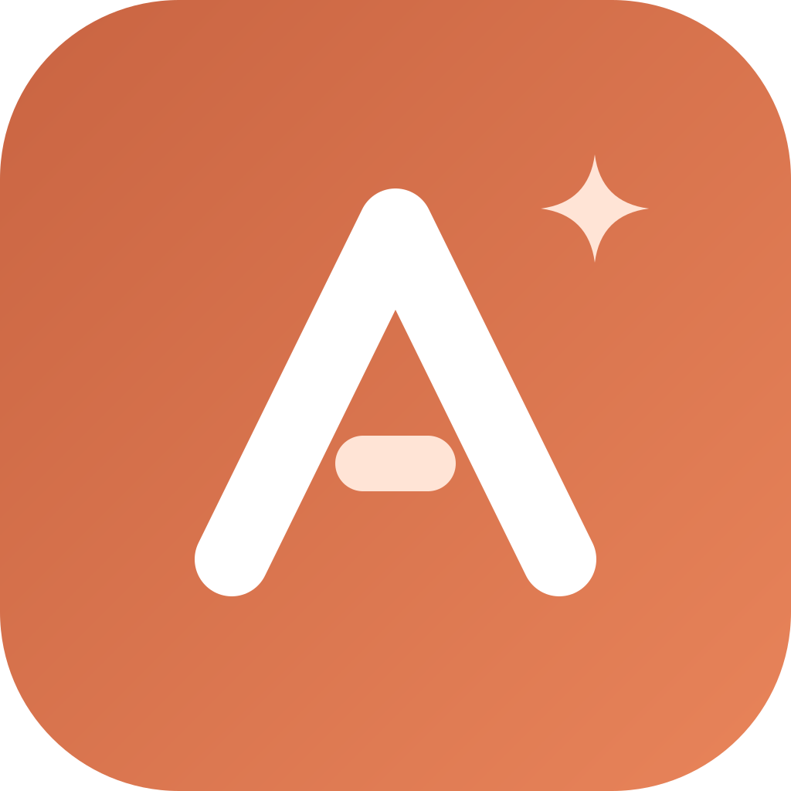

<p align="center">
  
</p>

<h1 align="center">Adalyn Interview Prep</h1>

<p align="center">An AI-powered desktop app for preparing for Software Engineering Intern interviews.<br>
Built with Tauri 2 (Rust backend) and Vite + vanilla JavaScript.</p>

---

## What it does

| Area | What you get |
|------|--------------|
| **💻 Coding Practice** | 17 intern-level problems across 11 patterns (hashing, two pointers, sliding window, stack, binary search, linked lists, trees, graphs, heaps, intervals, DP), plus AI-generated problems per pattern. Write your approach first, code in Python / Java / TypeScript / C++, take up to 3 progressive hints, then submit to an AI interviewer for a rubric scorecard, a hire verdict, and a follow-up question. |
| **🏗️ OOD Practice** | 10 classic object-oriented design problems with Python/Java skeletons and test scenarios, reviewed by an AI interviewer. |
| **📄 Resume Analyzer** | Upload a PDF or paste a resume. The app extracts bullets from work experience and projects, generates five deep-dive questions per bullet, and polishes and grades your answers against the intern bar. |
| **🎯 BQ Prep** | 16 built-in intern behavioral questions ("Tell me about yourself", "Why software engineering?", teamwork, failure, ambiguity…), a STAR story editor with voice input, and per-question answer tuning from your linked story. |
| **💼 Job Prep** | Paste a job posting URL: the app extracts the role, level, responsibilities, and skills, then scores each resume bullet for relevance. |
| **📚 Knowledge Chapters** | Turn any technical doc (URL, pasted text, PDF, or Markdown) into structured study notes, a 10-question quiz, and flashcards. |
| **🖼️ Knowledge Aggregator** | Turn a folder of screenshots or slides into one synthesized study document using vision models. |
| **📊 Dashboard** | Coding progress, behavioral coverage, quiz scores, flashcard mastery, and recommendations on what to practice next. |

The interview target is defined once in [`src/target.js`](src/target.js). Every prompt that generates questions or grades answers calibrates against it, so the app can be retargeted, for example to new-grad roles, by editing one file.

## How it works

- **Rust backend (Tauri commands).** In the desktop app, all LLM calls go through Rust so API keys stay out of the WebView. The backend also streams tokens back over Tauri channels, fetches and cleans web pages (HTML → text), extracts text from PDFs, and stores keys in the OS app-config directory.
- **Multi-provider LLM layer.** Claude, Gemini, or OpenAI, chosen in Settings. Requests are routed by tier: a stronger model for long-form analysis and a faster model for structured JSON such as quizzes and hints.
- **Fan-out / fan-in synthesis.** Knowledge chapters run three LLM calls in parallel over the fetched source material and merge the results into one framework. Quiz and flashcard generation is then grounded in that framework.
- **Interviewer → coach → grader workflow.** Resume deep dives use separate prompts to ask questions, polish your answer, and grade it against the intern rubric.
- **Structured outputs with recovery.** JSON responses are forced with assistant prefill where supported and parsed in layers (direct parse → extract the JSON span → per-item salvage), with a readable fallback so one malformed response doesn't break the session.
- **Local-first data.** Everything is stored in `localStorage` and can be exported or imported as a JSON backup. Optional cloud sync via Supabase (see [CLOUD_SYNC_PLAN.md](CLOUD_SYNC_PLAN.md)).

## Getting started

### Prerequisites

| Tool | Version |
|------|---------|
| Node.js | 18+ |
| Rust / Cargo | 1.77+ |
| Tauri CLI | 2.x (installed as a dev dependency) |

Windows also needs the [Visual Studio C++ Build Tools](https://visualstudio.microsoft.com/visual-cpp-build-tools/) and [WebView2](https://developer.microsoft.com/en-us/microsoft-edge/webview2/) (preinstalled on Windows 10/11).

### Run

```bash
npm install
npm run tauri dev        # desktop app (first run compiles the Rust crate)
npm run dev              # browser-only mode on http://localhost:1420
```

On first launch, open **⚙️ Settings**, pick a provider, and paste an API key:
- Anthropic: [console.anthropic.com](https://console.anthropic.com/settings/keys)
- Google Gemini: [aistudio.google.com](https://aistudio.google.com/app/apikey)
- OpenAI: [platform.openai.com](https://platform.openai.com/api-keys)

Keys are saved locally and are only sent to the provider you choose.

### Build

```bash
npm run tauri build      # installers in src-tauri/target/release/bundle/
npm run build:web        # static web build in dist-web/
```

## Project structure

```
adalyn-interview-prep/
├── index.html                 # App shell (sidebar + main area)
├── assets/logo.svg            # App logo (icons in src-tauri/icons are generated from it)
├── src/
│   ├── main.js                # Composition root: navigation + window exports
│   ├── target.js              # Interview target + grading bar used by all prompts
│   ├── api.js                 # Provider-aware LLM calls (text, JSON, streaming, vision)
│   ├── state.js               # Persistent state, storage keys, built-in BQ bank
│   ├── coding.js              # Coding Practice
│   ├── ood.js                 # OOD Practice
│   ├── analysis.js            # Knowledge-chapter synthesis (3 parallel calls)
│   ├── quiz.js, flashcards.js # Study modes
│   ├── jobprep.js             # Job posting analysis + resume matching
│   ├── aggregator.js          # Image → study doc pipeline
│   ├── dashboard.js           # Progress overview
│   ├── behavioral/            # Resume Analyzer, BQ Store, STAR stories
│   └── styles.css
└── src-tauri/
    ├── tauri.conf.json
    └── src/lib.rs             # Tauri commands: LLM proxies, fetch_url, PDF/image IO, key storage
```

## Data & privacy

All prep data stays on your machine unless you enable cloud sync. Backups (**Settings → Export**) contain your notes, stories, and answers but never API keys. Local `backup/` files are git-ignored.
